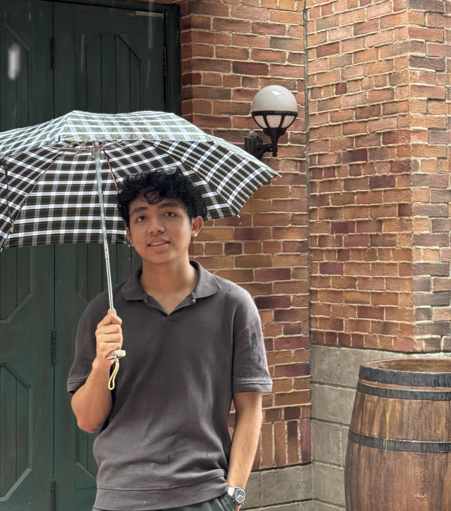

# Lab 3 - Developing software Test Cases Heading
Testing for content in a first level heading
## A second level heading Lab3
Testing for content in a second level heading
### A third level heading Lab3https://github.com/LINN-CODE/Lab3_practise/blob/master/README.md
Testing for contetn in a third level heading

<picture>
  <source media="(prefers-color-scheme: dark)" srcset="https://user-images.githubusercontent.com/25423296/163456776-7f95b81a-f1ed-45f7-b7ab-8fa810d529fa.png">
  <source media="(prefers-color-scheme: light)" srcset="https://user-images.githubusercontent.com/25423296/163456779-a8556205-d0a5-45e2-ac17-42d089e3c3f8.png">
  
</picture>

- testing unordered list one
- testing unordered list two
- testing unordered list three
- testing unordered list four

* testing with star 1
* testing with star 2
* testing with star 3

1. testing ordered list one
2. testing ordered list two
3. testing ordered list three

### Nested list
1. First list item
   - First nested list item
     - Second nested list item
2. Second list item
   - First nested list item
     - Second nested list item
